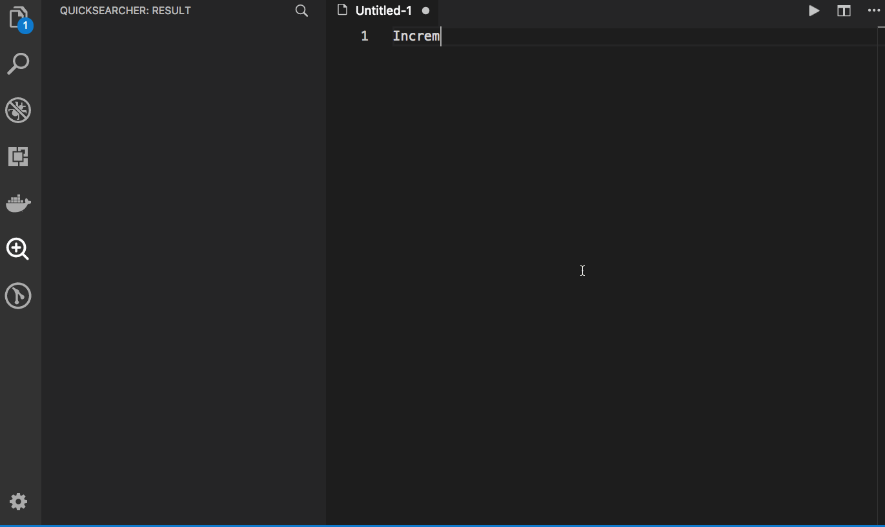

# quick-searcher

Quickly search words incrementally in workspace using the quick silver.

# Features

 commands | description 
 --- | ---
quickSearcher.search | display incremental search input box.  (preset selection if exists.)
quickSearcher.searchInFolder | same as `quickSearcher.search` but in selected folder. (context menu only)

# Extention settings

configurations | description
--- | ---
quickSearcher.searchBySelection.enabled | set to enable start searching by selection
quickSearcher.incrementalSearch.enabled | set to enable incremenatal search or not
quickSearcher.incrementalSearch.startBy | set to limit character length for staring incremenatal search
quickSearcher.incrementalSearch.delayMs | set to delay start searching
quickSearcher.searchItem.labelLength | set to limit length of searched words as label
quickSearcher.searchItem.expanded | set to expand searched items

## Requirements

[the_silver_searcher](https://github.com/ggreer/the_silver_searcher) is necessary
